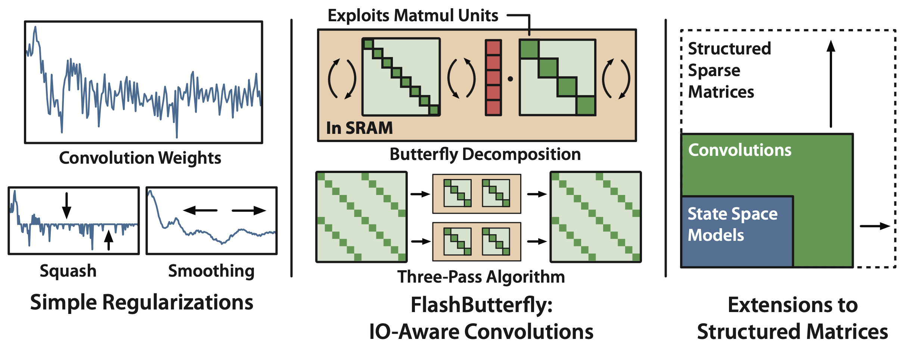
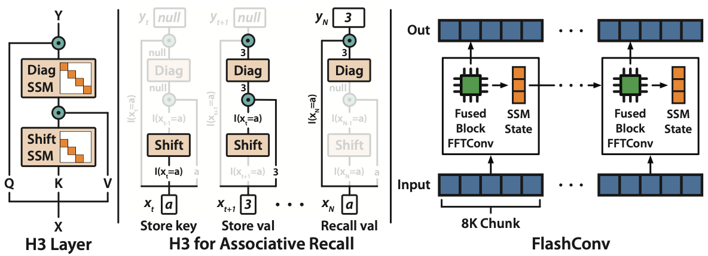

# Convolutions for Sequence Modeling

This repository provides implementations and experiments for the following papers, as well as simplified presentations of earlier work such as [S4](https://github.com/HazyResearch/state-spaces).

## Hyena 

**Hyena Hierarchy: Towards Larger Convolutional Language models**
Michael Poli\*, Stefano Massaroli\*, Eric Nguyen\*, Daniel Y. Fu, Tri Dao, Stephen Baccus, Yoshua Bengio, Stefano Ermon, Christopher Ré \
[Paper](https://arxiv.org/abs/2302.10866)


## Long Convs

**Simple Hardware-Efficient Long Convolutions for Sequence Modeling**\
Daniel Y. Fu*, Elliot L. Epstein*, Eric Nguyen, Armin W. Thomas, Michael Zhang, Tri Dao, Atri Rudra, Christopher Ré\
[Paper](https://arxiv.org/abs/2302.06646)


## Hungry Hungry Hippos (H3)

**Hungry Hungry Hippos: Towards Language Modeling with State Space Models**  
Daniel Y. Fu\*, Tri Dao\*, Khaled K. Saab, Armin W. Thomas, Atri Rudra, Christopher Ré  
International Conference on Learning Representations, 2023. Notable top-25% (spotlight).  
[Paper](https://arxiv.org/abs/2212.14052)



### Roadmap
- ~~Include H3, LLM training, and synthetics in this repository~~
- ~~Move in fast convolution code~~
- ~~Add Hyena implementation and experiments~~
- pip package

### Changelog
See [CHANGELOG.md](CHANGELOG.md)

## Setup

### Requirements
This repository requires Python 3.8+ and Pytorch 1.10+.
Other packages are listed in [requirements.txt](./requirements.txt).

## Getting Started
The easiest way to get started is to run the [`standalone_cifar.py`](./standalone_cifar.py) script.
This scripts trains a simple long convolution model on CIFAR-10:
```
python -m standalone_cifar
```

See the [experiments](./experiments.md) page for more:
* LRA experiments from the Long Convs paper
* H3 experiments (language model, synthetics)
* H3 + Long Conv experiments
* Hyena language and vision experiments

## Citation

If you use this codebase, or otherwise found our work valuable, you can cite us as follows:
```
@article{poli2023hyena,
  title={Hyena Hierarchy: Towards Larger Convolutional Language Models},
  author={Poli, Michael and Massaroli, Stefano and Nguyen, Eric and Fu, Daniel Y and Dao, Tri and Baccus, Stephen and Bengio, Yoshua and Ermon, Stefano and R{\'e}, Christopher},
  journal={arXiv preprint arXiv:2302.10866},
  year={2023}
}

@article{fu2023simple,
  title={Simple Hardware-Efficient Long Convolutions for Sequence Modeling},
  author={Fu, Daniel Y. and Epstein, Elliot L. and Nguyen, Eric and Thomas, Armin W. and Zhang, Michael and Dao, Tri and Rudra, Atri and R{\'e}, Christopher},
  journal={arXiv preprint arXiv:2302.06646},
  year={2023}
}

@inproceedings{fu2023hungry,
  title={Hungry {H}ungry {H}ippos: Towards Language Modeling with State Space Models},
  author={Fu, Daniel Y. and Dao, Tri and Saab, Khaled K. and Thomas, Armin W.
  and Rudra, Atri and R{\'e}, Christopher},
  booktitle={International Conference on Learning Representations},
  year={2023}
}
```

## Acknowledgements

This repo was forked from Albert Gu's [state spaces](https://github.com/HazyResearch/state-spaces) repo and borrows its structure.
It also contains code from the [FlashAttention](https://github.com/HazyResearch/flash-attention) training scripts.
